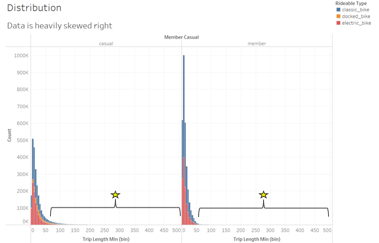
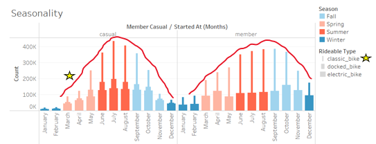

# Divvy Trip Data - Google Analytics Capstone Report
## Contents
### [Background](https://github.com/JarrydWannenburg/Divvy-Trip-Data-Google-Analytics-Capstone/blob/main/Report.md#background-1)
* [Scenario](https://github.com/JarrydWannenburg/Divvy-Trip-Data-Google-Analytics-Capstone/blob/main/Report.md#scenario)
* [About the company](https://github.com/JarrydWannenburg/Divvy-Trip-Data-Google-Analytics-Capstone/blob/main/Report.md#about-the-company)
* [Ask](https://github.com/JarrydWannenburg/Divvy-Trip-Data-Google-Analytics-Capstone/blob/main/Report.md#ask)
### [Report](https://github.com/JarrydWannenburg/Divvy-Trip-Data-Google-Analytics-Capstone/blob/main/Report.md#report-1)
* [Business task and stakeholder analysis](https://github.com/JarrydWannenburg/Divvy-Trip-Data-Google-Analytics-Capstone/blob/main/Report.md#business-task-and-stakeholder-analysis)
* [Data preparation](https://github.com/JarrydWannenburg/Divvy-Trip-Data-Google-Analytics-Capstone/blob/main/Report.md#data-preparation)
* [Data dictionary](https://github.com/JarrydWannenburg/Divvy-Trip-Data-Google-Analytics-Capstone/blob/main/Report.md#data-dictionary)
* [Data processing](https://github.com/JarrydWannenburg/Divvy-Trip-Data-Google-Analytics-Capstone/blob/main/Report.md#data-processing)
* [Analysis](https://github.com/JarrydWannenburg/Divvy-Trip-Data-Google-Analytics-Capstone/blob/main/Report.md#analysis)
    * [Distribution](https://github.com/JarrydWannenburg/Divvy-Trip-Data-Google-Analytics-Capstone/blob/main/Report.md#distribution)
    * [Seasonality](https://github.com/JarrydWannenburg/Divvy-Trip-Data-Google-Analytics-Capstone/blob/main/Report.md#seasonality)
    * [Day of the week](https://github.com/JarrydWannenburg/Divvy-Trip-Data-Google-Analytics-Capstone/blob/main/Report.md#day-of-the-week)
    * [Hourly](https://github.com/JarrydWannenburg/Divvy-Trip-Data-Google-Analytics-Capstone/blob/main/Report.md#hourly)
    * [Start station](https://github.com/JarrydWannenburg/Divvy-Trip-Data-Google-Analytics-Capstone/blob/main/Report.md#start-station)
    * [End station](https://github.com/JarrydWannenburg/Divvy-Trip-Data-Google-Analytics-Capstone/blob/main/Report.md#end-station)
    * [Trip duration](https://github.com/JarrydWannenburg/Divvy-Trip-Data-Google-Analytics-Capstone/blob/main/Report.md#trip-duration)
* [Conclusion and recommendations](https://github.com/JarrydWannenburg/Divvy-Trip-Data-Google-Analytics-Capstone/blob/main/Report.md#conclusion-and-recommendations)
* [Next steps](https://github.com/JarrydWannenburg/Divvy-Trip-Data-Google-Analytics-Capstone/blob/main/Report.md#next-steps)
---
## Background
### Scenario
You are a junior data analyst working in the marketing analyst team at Cyclistic, a bike-share company in Chicago. The director of marketing believes the company’s future success depends on maximizing the number of annual memberships. Therefore, your team wants to understand how casual riders and annual members use Cyclistic bikes differently. From these insights, your team will design a new marketing strategy to convert casual riders into annual members. But first, Cyclistic executives must approve your recommendations, so they must be backed up with compelling data insights and professional data visualizations.

### About the company
In 2016, Cyclistic launched a successful bike-share offering. Since then, the program has grown to a fleet of 5,824 bicycles that are geotracked and locked into a network of 692 stations across Chicago. The bikes can be unlocked from one station and returned to any other station in the system anytime. 

Until now, Cyclistic’s marketing strategy relied on building general awareness and appealing to broad consumer segments. One approach that helped make these things possible was the flexibility of its pricing plans: single-ride passes, full-day passes, and annual memberships. Customers who purchase single-ride or full-day passes are referred to as casual riders. Customers who purchase annual memberships are Cyclistic members. 

Cyclistic’s finance analysts have concluded that annual members are much more profitable than casual riders. Although the pricing flexibility helps Cyclistic attract more customers, Moreno believes that maximizing the number of annual members will be key to future growth. Rather than creating a marketing campaign that targets all-new customers, Moreno believes there is a very good chance to convert casual riders into members. She notes that casual riders are already aware of the Cyclistic program and have chosen Cyclistic for their mobility needs. 

Moreno has set a clear goal: Design marketing strategies aimed at converting casual riders into annual members. To do that, however, the marketing analyst team needs to better understand how annual members and casual riders differ, why casual riders would buy a membership, and how digital media could affect their marketing tactics. Moreno and her team are interested in analyzing the Cyclistic historical bike trip data to identify trends.

### Ask
Three questions will guide the future marketing program: 
1.	How do annual members and casual riders use Cyclistic bikes differently? 
2.	Why would casual riders buy Cyclistic annual memberships? 
3.	How can Cyclistic use digital media to influence casual riders to become members?
Moreno has assigned you the first question to answer: How do annual members and casual riders use Cyclistic bikes differently?

## Report
### Business task and stakeholder analysis 
The goal of this analysis is to understand how casual and annual riders use Cyclistic’s bikes differently by identifying trends and characteristics from historical data, so a new targeted marketing strategy can be developed centered on converting casual riders into annual members to maximize growth.

Knowing your customer is the first step to being able to market your product, so data on these groups is very valuable as insights can direct focus and highlight key areas that are fundamental to business decisions. In this example, an analysis of two customer groups could provide characteristics that Lily and her team can use in their marketing campaigns.

There are four primary stakeholders in this project:
1. _Lily Moreno_ - Director of Marketing: She is responsible for the development of campaigns and initiatives to promote the bike-share program. These may include email, social media, and other channels. Lily’s goal is to design targeted marketing strategies aimed at converting casual riders into annual members through the most effective digital channels.
2. _Cyclistic executive team_: The executive team will determine whether or not to approve Lily’s marketing campaign. To facilitate their decision, they want key insights and high-quality visuals assessing the situation.
3. _Cyclistic marketing analytics team_: A team, which I am a part of, consisting of data analysts who are responsible for collecting, analyzing, and reporting data that helps guide Cyclistic marketing strategy.
4. _Casual riders_ - Target customers: Casual riders are those who purchase single-ride or full-day passes. They may be recurring customers who have not committed to the annual pass, or they may be one-time riders (unable to answer this due to data privacy), therefore insights gathered from this group will need to be at an aggregate level. Converting casual riders into members is the core focus of this analysis since its believed that maximizing the number of annual members will be key to future growth. No Personally Identifiable Information (PII) exists for these users.
5. _Cyclistic members_ - Group to maximize: Members are those who have purchased the annual pass and are believed to be the most profitable customers.

### Data preparation
To make data decisions, you need data. For this project, I sourced data from the ['divvy-tripdata' bucket](https://divvy-tripdata.s3.amazonaws.com/index.html) under the following [license](https://ride.divvybikes.com/data-license-agreement). To respect users' privacy, any PII in the data has been removed and attempting to circumvent this is in direct violation of the licensing agreement. The data came in the form of 12 separate CSV files from May 2021 through April 2022 totaling 1GB (5,661,482 rows). 

After assessing the data, I found that there were some integrity issues stemming from data cleanliness, however there were no biases evident in the data. As a whole, the data ROCCCs. It comes from the [company](https://ride.divvybikes.com/system-data) itself and is widely used, so it is _reliable_. The dataset is _original_ and can be found on Divvy’s website and points towards the same data bucket. The dataset is _comprehensive_ as it contains vital information needed for this analysis including timing and location data. Most importantly, it captures the rider status of each trip which allows for comparison between casual and member riders. New data is added to the source every month with the most recent being that of April 2022 (time of analysis is May 2022), so the data is _current_. Finally, this data source is _cited_ as it’s a part of the Google Data Analytics curriculum available on [Coursera](https://www.coursera.org/professional-certificates/google-data-analytics) and, therefore, has been cited/used thousands of times. 

Simply having data does not mean that you'll have a strong analysis. The data in hand need to be relevant to the question posed. While this dataset is very limited, since there’s no information about the rider other than their classification, there lies value in knowing the characteristics of the trips typical to each group. By understanding the trips being taken by each group, we can effectively market memberships to casual riders in hopes of converting them and market to current members to increase retention. 

While the dataset available ROCCCs, there were some problems I noticed while preparing the data:
1. The lack of personal rider data makes it difficult to build a profile typical of each rider by location, age group, or gender (since this data is unavailable in this specific version of the dataset). Therefore, the analysis is restricited to characteristics of the _trips_ taken by each group.
2. There also appear to be outliers in the data which take the form of extremely long trip durations. For this task, outliers were removed from the member and casual rider groups if the trip duration did not seem to make sense (i.e., less than 60 seconds or greater than 8 hours which represents a “full day” trip on one bike). 60 seconds was chosen because the divvy team themselves [preprocess](https://ride.divvybikes.com/system-data) their data to remove trips under 60 seconds.
3. Since I wanted to visualize the starting and ending points for each trip, I had to remove a small amount trips since the latitude and longitude were not recorded (around 1,700 trips).

### Data dictionary
The sole dataset used for this capstone project is the ‘divvy-tripdata’ dataset available through their website and the Google Data Analytics course and hosted on amazon S3. The following data dictionary is of the filtered raw dataset (removed trips shorter than 60 seconds and longer than 24 hours):

| Field ID             | Data Type  | Description                                                       | Null count |
|---|---|---|---|
| ride_id              | Character  | A unique identifier for each trip                                 | 0          |
| rideable_type        | Character  | Record of bike type (docked bike, electric bike, or classic bike) | 0          |
| started_at           | Datetime   | Datetime of trip start time                                       | 0          |
| ended_at             | Datetime   | Datetime of trip end time                                         | 0          |
| start_station_name   | Character  | Start station name                                                | 766,171    |
| start_station_id     | Character  | A unique identifier for each start station                        | 766,168    |
| end_station_name     | Character  | End station name                                                  | 811,749    |
| end_station_id       | Character  | A unique identifier for each end station                          | 811,749    |
| start_lat            | Number     | Start latitude                                                    | 0          |
| start_lon            | Number     | Start longitude                                                   | 0          |
| end_lat              | Number     | End latitude                                                      | 1,727      |
| end_lon              | Number     | End longtitude                                                    | 1,727      |
| member_casual        | Character  | Record of rider type (member or casual)                           | 0          |
| trip_length \*       | HMS Number | HH:MM:SS representation of trip length (Ended_at -- Started_at)   | 0          |
| day_of_week \*       | Character  | Record of the name day of Started_at                              | 0          |
| trip_length_sec \*   | Number     | A second representation of Trip_length                            | 0          |
| trip length min \*\* | Number     | A minute representation of trip length                            | 0          |

_\* Field created in R_

_\*\* Field created in Tableau_

_The null values were evenly distributed amongst the months_

### Data processing
Due to the size of the data, I chose to process it using R. Using R for data cleaning and manipulation also increases reproducibility since the code is documented and easily ran. While merging the datasets to form one master dataset, I noticed that there were several thousand trips that were extremely long (between 8 and 24 hours). Because the distribution was heavily positively (right) skewed and not normally distributed, I wasn't able to use traditional means of outlier analysis like the 68-95-99.7% rule. The sheer size of the data also ruled out analytical methods like the Shapiro-Wilk Test (size must be between 3-5000) and Grubbs Test (not normally distributed and simply too big). I then considered using a boxplot and removing points that exceeded the maximum (Q3 + 1.5\*IQR), but that removed trips above 42 minutes and 50 seconds (which seemed too restrictive). Removing bike rides with durations longer than 43 minutes may make statistical sense, but I believe that it goes against common sense. It is entirely possible to have trips up and well above an hour or more. Ultimately, I decided to err on the side of caution with this preliminary analysis and only remove trips if they exceeded 8 hours in duration (which would be the length of a "full-day" rental). After filtering the data, I also decided to stick to median values for measures of central tendency, which came about as the median is more resistant to outliers than the mean.

For data visualization, I used Tableau as it’s publicly available and can produce high quality visuals. Initially, I used Tableau Public for visualizations but eventually had to switch to Tableau Desktop (free trial) since the size of the source data file was larger than 1GB (1.15G). After loading the data in, I created a minute representation of the trip length.

### Analysis
Using the available data, I was able to clearly show how annual members and casual riders use Cyclistic bikes differently. The structure of my findings follow a set of guided questions:
* What do users ride?
* When do they ride? (monthly/seasonal view)
* What days are they riding? (weekly view)
* What time are they riding? (hourly view)
* Where do they start their trips?
* Where do they end their trips?
* How long are their trips?

### Distribution
When looking at the distribution of the data, it's important to remember:
1. Trips below 60 seconds were removed as they were likely redocking attempts, errors, or trial rides.
2. Trips above 8 hours were removed are they were likely errors. 8 hours was chosen as a maximum as that represents a “full-day” trip. However, it's important to note that the business model of bike sharing also strongly encourages shorter trips which is evident in the distribution of trip length below.

As mentioned earlier, the data is heavily positively (right) skewed. The starred curly bracket on both charts demonstrates the extent of this skew which is artificially cut off at 8 hours. The legend to the top right of the data adds context to the different colored sub-bars making up the distribution. 

**Key Takeaways:**
1. Both groups take shorter rides over longer rides with the vast majority occuring under an hour.
2. Members take signficantly fewer longer rides than casual riders even though they have a higher frequency of total rides.
3. The median value should be used as a measure of central tendency, as opposed to the mean, since the median is more resilient to outliers.

**Next Step:** 
- Determine a suitable threshold for trip length based on business knowledge and data analytics.

Causal riders primarily ride either classic or electric bikes though there are some trips (around 10%) that result from docked bikes. Member riders solely ride either classic or electric bikes. It's clear from this visual that there's no docked bike offering to member riders. I believe that including docked bikes as an offering for members could convert casual riders who use these bikes and lead to an increase in our member size.

**Key Takeaways:**
1. Both rider types prefer classic bikes over electric bikes, so marketing should lean towards these bikes when creating advertisements.
2. About 10% of casual rides come from docked bikes which don’t appear to be an offering for members. Making these bikes available to members may lead to the conversion of a portion of the casual riders who use docked bikes.

**Next Step:** 
- Consult with financial analysts regarding the cost implications of adding docked bikes as an offering to members.

### Seasonality
As I began exploring the data, intuition told me that warmer weather would yield a higher frequency of trips. The visual below shows the data supported that claim.

There are clear seasonal effects on the number of trips taken for both groups with peak frequency in summer months. The distributions are also slightly different, with the member group appearing to be more resilient to colder weather. This could be because of self selection – those who know they will ride year-round, whether residents or relying on biking as transportation to work, choose to become members.

The member distribution is also dominated by classic bikes. It's clear that this group has an strong preference to classic bikes thoughout the year. However, causal riders, as seen by the distributions of October through April, appear to prefer classic bikes only as the weather warms up. 

Finally, the groups differ in the distribution of ride type. All ride types used by casual riders rise with warmer temperatures and fall with colder temperatures, but the same is not true for member riders. We see the same is true for classic bikes, but electric bikes see a decline in frequency from May through September. The difference appears to be picked up by classic bikes which may indicate that members switch from electric bikes to casual bikes as the weather warms. 

**Key Takeaways:**
1. Trip volume increases with warmer seasons though it is more apparent in the casual rider group than members.
2. Casual riders see an increase in all rideable types as volume increases, whereas members see a shift in towards classic bikes from electric bikes as the weather warms.

**Next Steps:** 
- Investigate seasonality effects in more detail. Seasonality may affect the times people ride outside or the day view of weekly distribution. 
- Add weather data to see what conditions are preferable for riding for each group.

### Day of the week
Another interesting difference is the distribution of trips at a daily view. Casual riders see a drastic decline in trips during the week, whereas members see a slight increase. 

There are clear weekly trends in both user groups. Causal riders have a strong preference for weekend trips which is represented by a significant volume increase on those days, and member riders take more trips on a given weekday than a day in the weekend. These two groups are polar opposites at the weekly view which may be the result of members commuting to work during the week and casual riders taking weekend bike rides as an activity.

**Key Takeaways:**
1. The trip frequency of casual riders significantly increases on the weekend, whereas member riders see a slight decrease.
2. Proportions of rideable types stay roughly similar for both groups throughout the week.

**Next Step:** 
- Explore how seasonality affects weekly distribution of trips. 

### Hourly
When focusing in on what time of the day users' cycle, we see a similar shape distribution on the weekends, but the two groups differ during the weekdays. 

**Key Takeaways:**
1. Casual riders have a unimodal distribution at the daily level with peaks around 5PM, but members have more of a bimodal distribution with peaks at 7/8AM and 5PM.
2. During the week, both groups have a higher trip frequency peaking from 4-6PM, but their weekend distributions peak from 1-3PM.

### Location
The two groups of riders also differ in where they start and end their trips. An important note for this map is that only (lat,lon) locations with more than 360 trips recorded are shown (360 chosen somewhat arbitrarily).
#### Start station

**Key Takeaways:**
1. Casual riders begin more trips closer to the shore, whereas members start locations appear to be more evenly distributed throughout the city.
2. Members have a cluster of start location volume towards the lower right of the map which may reflect resident-commuter riders.

#### End station

**Key Takeaways:**
1. At a group level, riders are ending their trips in very close proximity to where they started them.
2. The clusters for each group have the same shape and size for the start and end locations.

**Next Steps:** 
- Investigate how trip start and end locations differ amongst bike types and seasonality. 
- See how many trips in the data reflect round trips using the start and end latitude and longitude.

### Trip duration
preview text

Analysis

**Key Takeaways:**
1. Text

**Next Steps:** 
- Text

### Conclusion and recommendations
Conclusion:

Recommendations:
1. Include docked bikes in suite of bikes available to members
2. Focus marketing leading into the summer months (April, May, June)
3. Develop social media campaigns targeting casual and member riders separately as they two groups are different:
    - Casual: Clips of the shoreline/tourism sites and benefits of a membership since casual riders bike along the shore the most.
    - Member: Clips reflecting accessibility and ease of use since members mainly bike within the city.

### Next steps
The following next steps are related to a deeper analysis of the data:
* Determine a suitable threshold for trip length based on business knowledge and data analytics
* Investigate seasonality effects in more detail. Seasonality may affect the times people ride outside or the day view of weekly distribution. 
* Add in weather data to see what conditions are preferable for riding for each group.
* Investigate how trip start and end locations differ amongst bike types and seasonality. 
* See how many trips in the data reflect round trips using the start and end latitude and longitude. This would give us part of the picture of how users are using the bikes.
* Calculate distance traveled (using as the crow flies as a proxy) using start latitude and longitude and end latitude and longitude to then see how distance differs between the two groups.
